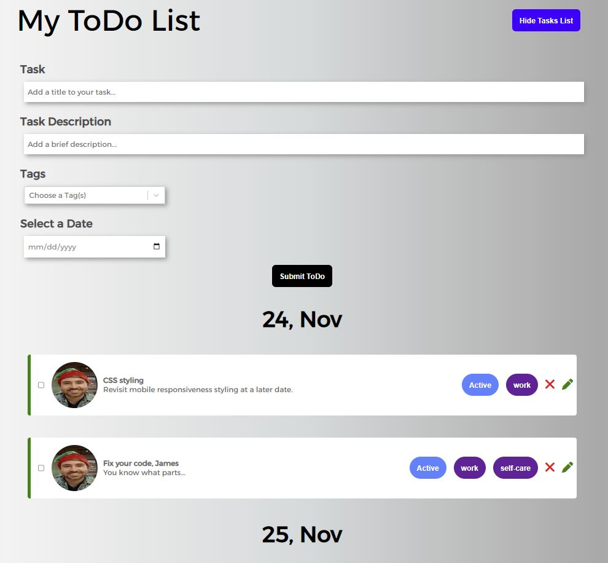

[](https://opensource.org/licenses/MIT)
  # MERN-stack Todo List App (containerized)
  ## Project Description
  This full-stack application is a todo list generator which allows the user to create a todo item and specify a title, description, one or more tags, and a date. The user can then click the submit button and a new todo item will be generated and added to the list below the todo form. Optionally, after creating the todo item the user can edit the title or description by clicking on the green pencil icon. A user can click the checkbox on the left side to mark the todo item as complete, or if they desire click on the red x to delete the todo item entirely from the screen. React.js powers the frontend; Node.js and Express.js power the backend; MongoDB is used as the database.
  ## Table of Contents
  * [Installation](#installation)
  * [Usage](#usage)
  * [License](#license)
  * [Contribute](#contributions)
  * [Tests](#tests)
  * [Questions?](#questions)
  ## Installation
  The installation assumes the user has Docker CLI and Docker Desktop installed on his or her machine. After cloning or downloading a local copy of the repository, from a terminal run the following commands:
  ```
  docker-compose build
  ```
  and then  
  ```
  docker-compose up
  ```
  The application should now be live and running.

  As is, the application is ready to run in a containerized environment. In other words, after cloning the repository onto one's local machine, the app should be run from docker-compose. However, if the user __does__ wish to run the app locally instead of from a containerized environment, the user needs to make two small adjustments:
  
  1. Edit the client folder's package.json file so that the _proxy_ field reads http://localhost:3001
  2. Edit the /server/config/connection.js file by commenting out line 4 and uncommenting line 5.

  With those two changes, the user can avoid having to use Docker at all and instead must run commands `npm install` (install package dependencies) and then `npm run develop` from the root of the application. Of course, running the app locally assumes a local installation of MongoDB server.
    
  ## Usage
  Once you have created and started to run the multiple containers, open a web browser and go to http://localhost:3000 to view the application. Alternatively if you wish to see the saved todo objects in json format, you can go to http://localhost:3001/api/tasks and the web browser will fetch them from the containerized MongoDB collection.<br><br>
  

  ## License
  <p align="center">Copyright 2022</p>
    <p align="center">=======================================</p><br>
    <details>
    <summary>Click for the legal stuff, if that's <em><strong>your thing</strong></em></summary>
    Copyright <YEAR> James Compagnoni

Permission is hereby granted, free of charge, to any person obtaining a copy of this software and associated documentation files (the "Software"), to deal in the Software without restriction, including without limitation the rights to use, copy, modify, merge, publish, distribute, sublicense, and/or sell copies of the Software, and to permit persons to whom the Software is furnished to do so, subject to the following conditions:

The above copyright notice and this permission notice shall be included in all copies or substantial portions of the Software.

THE SOFTWARE IS PROVIDED "AS IS", WITHOUT WARRANTY OF ANY KIND, EXPRESS OR IMPLIED, INCLUDING BUT NOT LIMITED TO THE WARRANTIES OF MERCHANTABILITY, FITNESS FOR A PARTICULAR PURPOSE AND NONINFRINGEMENT. IN NO EVENT SHALL THE AUTHORS OR COPYRIGHT HOLDERS BE LIABLE FOR ANY CLAIM, DAMAGES OR OTHER LIABILITY, WHETHER IN AN ACTION OF CONTRACT, TORT OR OTHERWISE, ARISING FROM, OUT OF OR IN CONNECTION WITH THE SOFTWARE OR THE USE OR OTHER DEALINGS IN THE SOFTWARE
    </details>
  Legalese borrowed from <a href="https://opensource.org/licenses/MIT" target="_blank">here</a>.

  ## Contribute
  n/a

  ## Tests
  n/a

  ## Questions?
  I enjoy hearing back about my work. You can reach me at jcomp_03@yahoo.com.
  Alternatively, contact me on my GitHub page <a href="https://github.com/jcomp-03">here</a>.
  